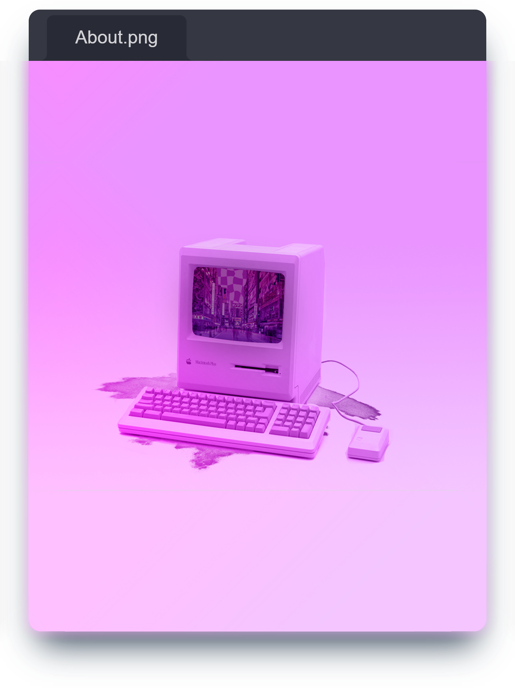

  

 

<h2 align="center">🤓 Junior Full Stack Web & App Developer</h2>

‣ Obsessed with rabbits 🰠
‣ Avid amateur coder 👩🏻‍💻 
‣ Vinyl collector 📀 
‣ Music enjoyer 🵠
‣ Old tech connoisseur 📼

 

Currently learning: <a href="https://nodejs.org/en"> <b style="color:black">Node.js</b></a>, <a href="https://www.postgresql.org/"> <b style="color:black">PostgreSQL</b></a> and <a href="https://expressjs.com/"> <b style="color:black">Express</b></a>

 

You can always reach me via email: <a href="mailto:hi@mochibun.me"><b>hi@mochibun.me</b></a> 📨🐇

I can also be reached on:

 
 
 

 

----
 

<h3 align="center">⚙️What's my tech stack?</h3>

> 
<i>It's incomplete as I'm still studying to become a junior full stack web and app dev but so far it's (to a varying degree):</i>

 

<table>
<thead>
  <tr>
    <th>Languages</th>
    <th>Front End</th>
    <th>Back End</th>
    <th>Databases</th>
    <th>Additional Tools</th>
    
  </tr>
</thead>
<tbody>
  <tr>
    <td>
      
    </td>
    <td>
      
      <a href="https://developer.mozilla.org/en-US/docs/Web/CSS">
      <a href="https://getbootstrap.com/">
      <a href="https://tailwindcss.com/">
      <a href="https://react.dev/">
      <a href="https://nextui.org/">
    </td>
    <td>
       
      
    </td>
    <td>
       
      <a href="https://www.youtube.com/watch?v=oi0D2gFnWdw"> 
    </td>
    <td>
      
      
      
      
      
      
      
      
    </td>
  </tr>
</tbody>
</table>

----

<h3 align="center">🏆Achievements</h3>

  

<h3 align="center">📈Statistics</h3>

<a href="https://github.com/Mochibunn">

<h3 align="center">⚡Activity</h3>

----

<h1 align="center" style="text-decoration:none">If you're a recruiter for an IT company,</h1>

 

----

 <b>Ssss..</b>

<picture>
  <source media="(prefers-color-scheme: dark)" srcset="https://raw.githubusercontent.com/Mochibunn/Mochibunn/output/github-contribution-grid-snake-dark.svg" />
  <source media="(prefers-color-scheme: light)" srcset="https://raw.githubusercontent.com/Mochibunn/Mochibunn/output/github-contribution-grid-snake.svg" />
  
</picture>

 

<b>Profile visits:</b>

